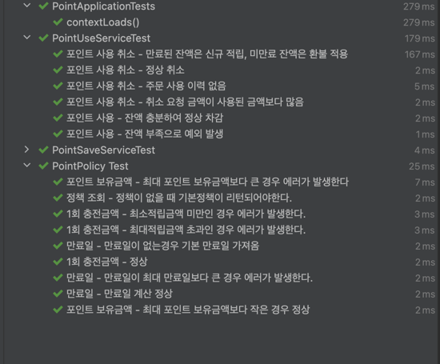
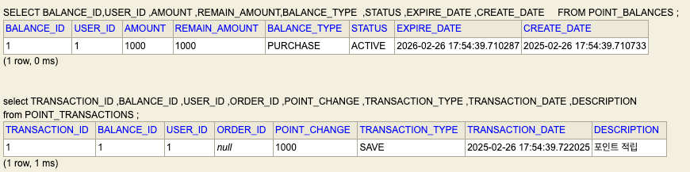
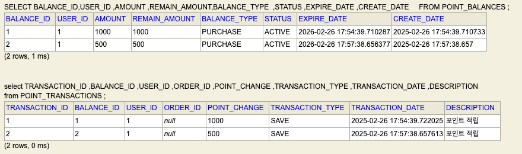
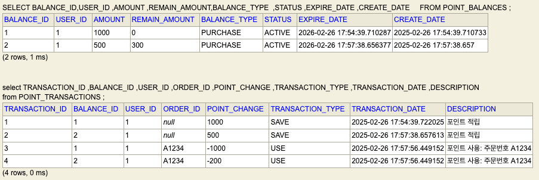
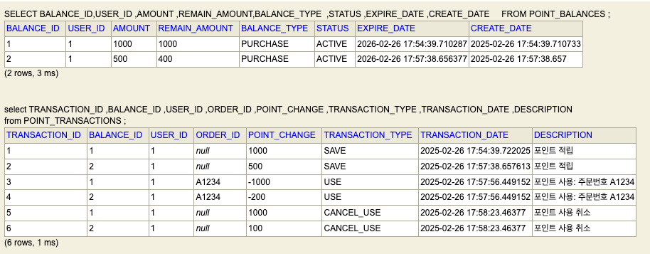

## 포인트 시스템 (API)

### 기술
- JAVA 21
- Spring Boot 3.4.3
- H2 DB

### 요구사항
- 적립, 적립 취소, 사용, 사용 취소 요구 사항에 맞게 구현

### 실행 방법
1. SpringBoot를 실행
2. 브라우저에서 localhost:8080/h2-console로 접속합니다.
3. jdbc:h2:mem:pointdb;, UserName: sa, Password: 없음

point.http (적립, 적립 취소, 사용, 사용 취소 API)

### 테스트

1. 정책
   - 1회 적립가능 최소,최대 값 검증
   - 개인 최대 보유 가능 포인트 검증
   - 만료일 계산 검증
2. 사용
   - 사용 - 사용 가능 포인트 검증
   - 사용 - 잔액 부족 검증
   - 사용취소 - 만료된 잔액은 신규적립, 미만료 잔액은 사용취소 적용 검증
3. 적립
   - 적립 - 정상 동작 검증
   - 적립취소 - 정상동작 검증

## 포인트 시스템 (설계)

### Service
- PointService (포인트 관련 작업의 오퍼레이션 계층)
- PointPolicyService (포인트 시스템의 정책 관리 및 검증을 담당)
- PointUseService (포인트 사용 및 사용 취소와 관련된 비즈니스 로직)
- PointSaveService (포인트 적립 및 적립 취소와 관련된 비즈니스 로직)

### Domain
- PointPolicy 
  - 포인트 정책을 나타내며, 적립, 사용, 만료 정책을 정의합니다.
- PointBalance (포인트 정책 엔티티)
  - 사용자의 포인트 적립 내역을 나타내며, 포인트의 총액, 남은 잔액, 적립 시점 및 만료일을 기록합니다.
- PointTransaction
  - 포인트와 관련된 모든 거래 내역(적립, 사용, 사용 취소 등)을 기록합니다.

## 시나리오

### 첫 번째 적립 (1000 포인트)

### 두 번째 적립 (500 포인트)

### 주문 "A1234"에서 1200 포인트 사용

### 주문 "A1234"의 사용 거래 중 1100 포인트 부분 취소

